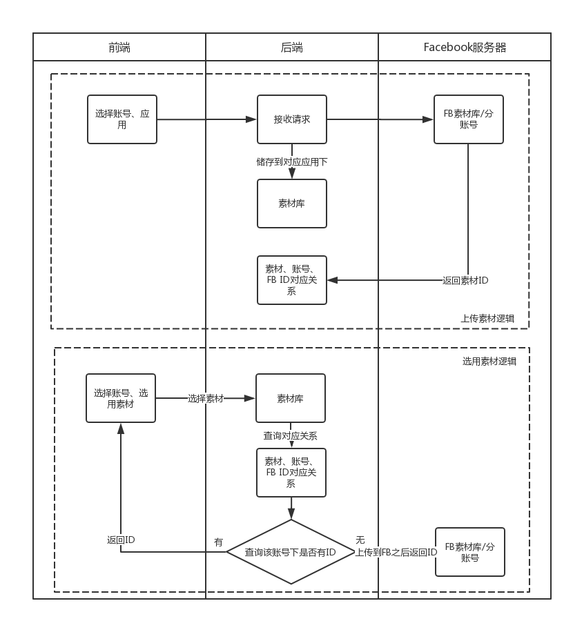
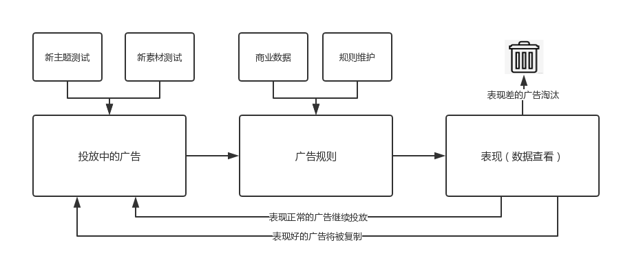

# Facebook广告投放自动化需求1.0（流川枫）

## 目录
   * [Facebook广告投放自动化需求1.0（流川枫）](#facebook广告投放自动化需求10流川枫)
      * [目录](#目录)
      * [项目概述](#项目概述)
         * [需求背景](#需求背景)
            * [项目目标](#项目目标)
         * [规划和进度](#规划和进度)
            * [系统规划](#系统规划)
            * [进度](#进度)
      * [功能需求](#功能需求)
         * [创建](#创建)
            * [批量创建（一期功能）](#批量创建一期功能)
               * [功能背景](#功能背景)
               * [流程图](#流程图)
               * [原型图](#原型图)
               * [前端需求](#前端需求)
               * [后端需求](#后端需求)
               * [基本信息](#基本信息)
                  * [选择广告账户、应用](#选择广告账户应用)
                  * [创建名称](#创建名称)
               * [投放信息](#投放信息)
                  * [新建模板](#新建模板)
                  * [模板结构](#模板结构)
                  * [字段对应关系](#字段对应关系)
                  * [名称组成规则](#名称组成规则)
                  * [审核规则](#审核规则)
                  * [国家代码转换规则](#国家代码转换规则)
               * [素材选择](#素材选择)
                  * [选择方式](#选择方式)
                  * [关联素材](#关联素材)
                  * [广告创建规则](#广告创建规则)
               * [广告账户、应用列表](#广告账户应用列表)
               * [前后端交互](#前后端交互)
                  * [流程图](#流程图-1)
                  * [json结构](#json结构)
                  * [json字段表](#json字段表)
                  * [上传所需接口、参考文档](#上传所需接口参考文档)
                  * [创建所需字段处理方法](#创建所需字段处理方法)
            * [素材库（一期功能）](#素材库一期功能)
               * [需求背景](#需求背景-1)
                  * [流程图](#流程图-2)
                  * [原型图](#原型图-1)
               * [素材上传&amp;使用](#素材上传使用)
                  * [素材使用](#素材使用)
                  * [素材库管理](#素材库管理)
         * [投放](#投放)
            * [数据查看](#数据查看)
               * [功能背景](#功能背景-1)
               * [查看数据](#查看数据)
               * [数据筛选、排序](#数据筛选排序)
               * [原型图](#原型图-2)
            * [投放规则](#投放规则)
               * [流程图](#流程图-3)
      * [非功能需求](#非功能需求)
         * [账号管理](#账号管理)
      * [附录](#附录)
         * [Token手动获得方式](#token手动获得方式)
         * [生成长期Token](#生成长期token)
         * [Business Manager平台](#business-manager平台)
            * [查看自有帐户](#查看自有帐户)
            * [查看商务管理平台拥有的应用](#查看商务管理平台拥有的应用)
            * [认领应用](#认领应用)
            * [生成token](#生成token)
            * [项目](#项目)
               * [项目的广告帐户](#项目的广告帐户)
               * [项目的应用](#项目的应用)
            * [给用户分配广告账户](#给用户分配广告账户)
               * [管理用户和身份](#管理用户和身份)
               * [邀请用户](#邀请用户)
               * [添加用户到帐户](#添加用户到帐户)


## 项目概述

### 需求背景

在日常的投放中发现并Facebook的人确认过后，确定在FB投放的每个广告和素材都能拿到一定的基础展示，所以想用自动化的手段来增加素材、广告的数量，目的是增加投放展示。

Facebook 营销API中提供了很多接口可以解决目前投放中遇到的问题（如批量创建、数据管理等）、提高投放的效率（自动投放），所以需要一个后台系统来调用API。

#### 项目目标

成本可控的情况下，通过自动化提高广告投放的数量，获得更多的展示

### 规划和进度

#### 系统规划


- 投放自动化流程

1. 多渠道素材采集
2. 批量创建广告
3. 根据情况、算法实时调整出价
4. 数据管理、查看投放效果


#### 进度

- **第一期：（8月初上线）**

新主题盲测批量创建

> 目前进度：开发中

- **第二期：（8月中旬）**

新主题自动化投放，应用rule，接入商业LTV数据，数据查看

> 目前进度：正在整理规则，商业LTV数据接口需求已提

- **第二期：（8月底）**

接入CM design接口、图片拼接

素材生产自动化，扩大素材数量级

> 目前进度：—


## 功能需求

### 创建

#### 批量创建（一期功能）

##### 功能背景

1.提高投放效率

因为Launcher是以主题为单位来进行投放的，每周都会有新主题进行投放。而在一个新主题的投放工作里，最为繁琐重复的就是创建广告功能。所以需要批量上传工具来提升运营投放效率。

2.跑通自动化投放流程

投放自动化需求中，最基本的需求就是利用API进行广告的创建，后期会有各种不同场景的自动创建广告需求，所以首先需要验证的就是创建功能。


- 解决思路

在Ad这一级，通过选择素材的数量直接决定广告的数量，减去Ad这一级之后，需要提供信息就只有Campaign和Adset层级。而投放信息通过将部分字段写死，另外一部分字段通过模板复用，从而减少了投放信息的维护。


##### 流程图


##### 原型图

[原型图链接](https://motodriver.github.io/demo/%E5%8E%9F%E5%9E%8B%E5%9B%BE/index.html)


##### 前端需求

1.批量创建功能界面

2.素材库


##### 后端需求

1.创建广告接口

后端接收到来自前端的json请求后解析，将信息分为四类（Campaign,Adset,Ad,Adcreative)，并且按照顺序上传创建广告。

> 预留点
> - 能接收创建各层级（Campaign到Adcreative层级）的单独创建请求的接口。
> - 能向已有的Campaign中创建广告组、广告（如果前端返回了Campaign id这个字段，就在对应的Campaign中创建。


2.素材库的建立；前端上传完素材后，需要将素材上传到Facebook服务器，并将返回的素材id和文件一一对应。


3.拉取广告账户、应用列表的接口

> 预留点
>
> - BM平台的Admin权限下来之后，广告账户和应用的拉取，将实时通过Facebook API来完成
> - 这个功能放在最后做，这两周之内我会尽量申请到权限


4.测试广告账户、应用是否有关联的接口

> 预留点
>
> - 关联关系可能会在之后的拉取数据功能中用到，所以需要找个地方存起来。

5.投放信息模板拉取


##### 基本信息

维护上传所需的基本信息。


###### 选择广告账户、应用

选择本次创建要使用的广告账户，以及关联的应用。

账号、应用列表从后端拉取。


###### 创建名称

由运营创建时手动输入，作为正式上传名称的一部分字符串，后面选择投放信息应用模板时在前端合成正式名称。

合成规则在【名称组成规则】中详叙。


##### 投放信息

投放信息以模板形式上传，运营在在前端填写完模板后，储存在后端，每个用户的模板是独立储存的。

每次批量创建都可以选择之前填写的模板，需要前端提供一个编辑、删除模板的入口，新增模板的入口在选择模板的边上。

> **为什么要使用模板上传**
>
> 每次新主题创建广告所需要的信息（不包括素材），其实是有很大的重复的，按照能复用的频率来看，能分成三种信息
>
> | 类型         | 信息                       | 处理方式           |
> | ------------ | -------------------------- | ------------------ |
> | 一定要上传的 | 基本信息（应用名、账号Id） | 每次上传填写或选用 |
> | 大概率能复用 | 名称，出价，国家等字段     | 使用模板方式来复用 |
> | 一定能复用的 | 竞价方式等                 | 写死在后端         |
>
> 使用模板后，大部分时间只需要维护一定要上传的这部分信息，这样就提高了创建的效率。


###### 新建模板

- 模板名称

手动输入模板名称

- 新建广告系列

手动输入广告系列名称

- 新建所属的广告组

输入创建广告组所需的字段，有两种信息输入方式

1.手动输入信息，点击'新增广告组'则增加空白行。

2.通过Excel粘贴批量输入，分隔符为\t

注意：不输入任何广告组也可以提交进入下一步。

- 显示信息

显示已创建的广告系列名称和对应的广告组数量，每一行边上有删除按钮

  

###### 模板结构

新建模板后，以如下结构的json储存在前端。


###### 字段对应关系

模板中的字段需要转换后放在给后端的json中，转换关系如下：

| 模板中字段名称 | 对应给后端的字段          | 处理方法                                                     |
| -------------- | ------------------------- | ------------------------------------------------------------ |
| 广告系列名称   | Campaign:name             | 模板中的名称只是作为合成上传名称的部分字符串，和其他名称一起组成上传的名称 |
| 广告组名称     | AdSet:name                | 模板中的名称只是作为合成上传名称的部分字符串，和其他名称一起组成上传的名称 |
| 国家           | AdSet:targeting:countries | 单选的国家按照附1【国家-国家代码对应关系】转换后上传即可，单选'全球'则；多选的国家需要用英文逗号拆分后转换为国家代码加入 country_groups中 |
| 出价           | AdSet:bid_amount          | 传入即可                                                     |
| 单日预算       | AdSet:daily_budget        | 需要将数值转换后传入，例：10转换为1000                       |
| 加速状态       | AdSet:pacing_type         | 加速：`no_pacing` 匀速：`standard`                           |


###### 名称组成规则

正式用API上传的名称，是由运营填写/选择的字段拼接而成的，拼接规则如下。

| 名称         | 组成规则                                                     | 对应字段         |
| ------------ | ------------------------------------------------------------ | ---------------- |
| 广告系列名称 | 关联应用名称+创建名称+模板中的广告系列名称                   | Campaign:name    |
| 广告组名称   | 关联应用名称+创建名称+模板中的广告系列名称+模板中广告组名称  | AdSet.Field:name |
| 广告名称     | 关联应用名称+创建名称+模板中的广告系列名称+模板中广告组名称+关联素材文件编号 | Ad:name          |

> 广告系列、广告组名称创建示例

- 关联应用名称为：3D cute cat
- 创建名称为：盲测
- 模板中的广告系列名为：一类国家
- 模板中的广告组名为：美国

则正式上传的广告系列名称为 **3D cute cat 盲测 一类国家**

广告组名称为**3D cute cat 盲测 一类国家 美国**

---

**广告名称=广告组名称+文案标号+视频文件名+封面图编号+图片编号**

> 广告名称创建示例

- 广告组名称为**3D cute cat 盲测 一类国家 美国**
- 关联的素材为：
>  标题：3D cute cat 
>  文案1（T1)：****
>  视频1：竖版.mp4(文件名) + 封面图1（C1）
>  视频2：横版.mp4(文件名) + 封面图2（C2）

则这个广告组下产生的4个广告（更详细的广告创建规则参考【广告创建规则】，这里只解释名称创建规则）分别名为：

> - 3D cute cat 盲测 一类国家 美国 T1 竖版 C1
> - 3D cute cat 盲测 一类国家 美国 T1 竖版 C2
> - 3D cute cat 盲测 一类国家 美国 T1 横版 C1
> - 3D cute cat 盲测 一类国家 美国 T1 横版 C2


###### 审核规则

模板中的信息需要审核后再储存，审核规则如下。

| 模板中字段名称 | 对应投放信息字段                | 审核规则                                                     |
| -------------- | ------------------------------- | ------------------------------------------------------------ |
| 广告系列名称   | Campaign.name                   | 不用审核                                                     |
| 广告组名称     | AdSet.Field.name                | 不用审核                                                     |
| 国家           | AdSet.Field.targeting:countries | 检查中文国家名称是否在【国家-国家代码对应关系】中，多选国家需要拆开后检查 |
| 出价           | AdSet.bid_amount                | 出价<=2                                                      |
| 单日预算       | AdSet.Field.daily_budget        | 单日预算>0                                                   |
| 加速状态       | AdSet.Field.pacing_type         | 只能为：''匀速'' 或 ''加速''                                 |


###### 国家代码转换规则

在需求文档-附录-国家代码转换规则里，需求文档同目录里有csv版本。


##### 素材选择

通过选择素材的数量，直接在选定的广告组下创建对应数量的广告。


###### 选择方式

- 通过广告系列选择

选择一个广告系列则是选中了其所属的所有广告组，下拉列表框，可以多选，可以全选。

- 通过广告组选择

广告组选择，下拉列表框，可以多选，可以全选。


###### 关联素材

标题、文案需要每次关联时输入，都只支持单个，不支持一次关联多个标题、文案。

有三种素材关联方式：

这三种方式互斥，只能单选，不能多选。

被选择的图片、视频、封面图需要从后端拉取，图片、封面图需要拉取缩略图和文件名;视频最好可以拉取首帧和文件名，实现难度大的话拉取文件名即可。

- 选择图片
- 选择视频
- 选择视频+封面图

关联完成后，将对应的素材编号（不是文件名，是素材对应的Facebook素材编号！）传入json中。


###### 广告创建规则

- 选择图片

可单选可多选，选择几张图片则在选定的广告组创建几个广告。

**创建数量 = 图片数量**

- 选择视频

可单选可多选，选择几张视频则在选定的广告组创建几个广告。

**创建数量 = 视频数量**

- 选择视频+封面图

视频、封面图都是必选，选择后创建视频、封面图排列组合的广告。

**创建数量 = 视频数量*封面图数量**

> 例：
>
> 选择了视频1、视频2
>
> 封面图1、封面图2
>
> 则在对应的广告组下创建：
>
> 视频1-封面图1
>
> 视频1-封面图2
>
> 视频2-封面图1
>
> 视频2-封面图2


##### 广告账户、应用列表

列表通过Business Manger API拉取，具体方法可以参考[参考文档]()或需求文档附录中【Business Manager】一节。


##### 前后端交互

###### 流程图


###### json结构

json结构需要前后端协商制定。


###### json字段表

| 字段名称（key)            | 字段值（value)                       | 字段类型 |
| ------------------------- | ------------------------------------ | -------- |
| AD_ACCOUNT_ID             | 账号编号                             | string   |
| APP_ID                    | 应用编号                             | int      |
| Campaign_info             | Campaign信息构成的字典               | dict     |
| 生成的Campaign名称        | 对应Campaign信息构成的字典           | dict     |
| Adset_info                | Adset信息构成的字典                  | dict     |
| 生成的Adset名称           | 对应Adset信息构成的字典              | dict     |
| AdSet_bid_amount          | 对应广告组的出价                     | float    |
| AdSet_daily_budget        | 对应广告组的单日预算                 | int      |
| AdSet_pacing_type         | 对应广告组的加速状态                 | string   |
| AdSet_targeting:country   | 对应广告组的目标国家（单选国家情况） | string   |
| AdSet_targeting:countries | 对应广告组的目标国家（多选国家情况） | list     |
| AdSet_targeting:rule      | 自定义受众：除了安装关联应用的受众   | string   |
| Ad_info                   | Ad信息构成的字典                     | dict     |
| 生成的Ad名称              | 对应Ad信息构成的字典                 | dict     |
| Ad_title                  | 运营填写的标题（会有多语言）         | string   |
| Ad_text                   | 运营填写的文案（会有多语言）         | string   |
| Ad_image_id               | Facebook素材库中的图片编号           | string   |
| Ad_video_id               | Facebook素材库中的视频编号           | string   |
| Ad_cover_id               | Facebook素材库中的封面图编号         | string   |
| Ad_app_link               | 关联应用的Google   play链接          | string   |


###### 上传所需接口、参考文档

| 层级       | 说明              | 上传说明                                   | 库                                        | 接口               | 参考文档地址 |
| ---------- | ---------------- | -------- | ------------------------------------------ | ----------------------------------------- | ------------------ | ------------------ |
| Campaign   | 广告系列         | 创建后，返回Campaign ID                    | facebookads.adobjects.adaccount.AdAccount | create_campaign    |[Campaign](https://developers.facebook.com/docs/marketing-api/reference/ad-campaign-group)|
| Adset      | 广告组        | 使用返回的Campaign ID创建Adset             | facebookads.adobjects.adset.AdSet         | adset.update       |[Ad set](https://developers.facebook.com/docs/marketing-api/reference/ad-campaign)|
| Ad        | 广告         | 使用返回的Ad set ID和广告创意创建Adset     | facebookads.adobjects.adaccount.AdAccount | create_ad          |[Ad](https://developers.facebook.com/docs/marketing-api/reference/adgroup)|
| Adcreative | 广告创意（素材）| 会从后端收到素材id，使用素材id创建广告创意 | facebookads.adobjects.adaccount.AdAccount | create_ad_creative |[Ad creative](https://developers.facebook.com/docs/marketing-api/reference/ad-creative) |


###### 创建所需字段处理方法

创建所需字段，包括了一部分写死的字段的处理方法。

| 创建层级              | 所需字段                        | 含义                         | 字段来源                                | 参考文档 |
| --------------------- | ------------------------------- | ---------------------------- | --------------------------------------- | --------------------------------------- |
| 广告系列（Campaign)   | Campaign.name                   | 广告系列名称                 | 前端                                    ||
|                       | Campaign.objective              | 营销目标                     | 默认为：应用安装量                      ||
|                       | Campaign.status                 | 广告系列状态                 | 批量上传时为Pause，所有上传完成后Active ||
| 广告组（Adset)        | AdSet.Field.name                | 广告组名称                   | 前端                                    ||
|                       | AdSet.Field.campaign_id         | 广告系列编号                 | 自动连线，创建Campaign时获取            ||
|                       | AdSet.Field.daily_budget        | 单日预算                     | 前端                                    ||
|                       | AdSet.Field.billing_event       | 计费方式                     | 默认为：impression                      ||
|                       | AdSet.Field.optimization_goal   | 优化目标                     | 默认为：应用安装量                      ||
|                       | AdSet.Field.bid_amount          | 出价                         | 前端                                    ||
|                       | AdSet.Field.start_time          | 开始时间                     | 自动取上传当天的日期                    ||
|                       | AdSet.Field                     | 结束时间                     | 默认为：长期                            ||
|                       | AdSet.Field.pacing_type         | 加速状态                     | 前端                                    ||
|                       | AdSet.Field.targeting:rule      | 目标受众中的自定义受众       | 默认为：除了安装关联应用的受众          |[创建自定义受众参考文档](https://developers.facebook.com/docs/marketing-api/audiences-api/mobile-apps)|
|  | AdSet.Field.targeting:genders   | 目标受众中的性别             | 默认为：不限                            ||
|                       | AdSet.Field.targeting:countries | 目标受众中的国家             | 前端（需要区分单选和多选的情况）        ||
|                       | AdSet.Field.targeting:age_min   | 目标受众中的年龄（最小年龄） | 默认为：18                              ||
|                       | AdSet.Field.targeting:age_max   | 目标受众中的年龄（最大年龄） | 默认为：65                              ||
| 广告（Ad)             | Ad.name                         | 广告名称                     | 前端                                    ||
|                       | adset_id                        | 广告组编号                   | 自动连线，创建广告组时获取              ||
|                       | creative-id                     | 广告创意                     | 自动连线，创建广告创意时获取 ||
| 广告创意（Adcreative) | creative                        | 广告创意                     | 前端        ||
|   | AdCreativeLinkData.Field.link |素材 - app link|前端||
|                       | AdCreativeLinkData.Field.caption | 素材 - 图片标题                | 前端（这个字段是不是标题需要确认一下）       ||
|                       | AdCreativeLinkData.Field.message | 素材 - 图片文案              | 前端                              ||
|                       | AdCreativeLinkData.Field.image_hash | 素材 - 图片                  | 前端                              ||
|                       | AdCreativeVideoData.Field.video_id | 素材 - 视频                  | 前端                              ||
| | AdCreativeVideoData.Field.image_url |素材 - 封面图|前端||
| | AdCreativeVideoData.Field.description |素材 - 视频文案|前端||
|                       | call_to_action：type     | 素材 - 行动号召              | 默认为：INSTALL_MOBILE_APP ||
| | call_to_action：value:link |素材 - 行动号召|默认为:app link||
| | call_to_action：value:link_title |素材 - 视频标题|||
| 素材 ||素材id|前端||


#### 素材库（一期功能）

##### 需求背景

1.批量创建功能需要提前上传素材到Facebook服务器，减少单次创建的信息量。

2.不同应用之中会有素材需要复用的情况，需要将上传过的素材储存起来。

3.后期的自动化需求通过其他接口产生素材，需要一个素材库将创建功能和素材接口连接起来。


###### 流程图



###### 原型图

[素材上传原型图](https://motodriver.github.io/demo/%E5%8E%9F%E5%9E%8B%E5%9B%BE/%E7%B4%A0%E6%9D%90%E4%B8%8A%E4%BC%A0.html)


##### 素材上传&使用

###### 素材使用

当选择定好关联方式时，调出素材库选择界面，只需要展示对应的类型。（关联方式选择图片时，默认拉取当前选择应用的图片，同时界面上也有选择其他应用的选项，但是不能选择其他的类型）

当选择素材时，展示文件缩略图和文件名，按照时间倒序排列（新上传的在前）。

当运营选定素材后，后端不用给前端文件，只要给前端文件对应的素材id。

前端将素材id写进创建信息json中，传回后端。


###### 素材库管理

素材库第一期只有上传的入口，没有删查减的入口。


- 第一级

以应用名来区分的文件夹

- 第二级

以类型区分的文件夹，类型有Video\Photo\Cover三种


### 投放

#### 数据查看

##### 功能背景

1. 因为Facebook政策限制，一个账号下的投放应用是有限的，所以创建了很多账号。同一个应用，可能投放的数据分布在各个账号中，查看数据的时候十分不方便，需要有一个统一的数据查看平台。
2. 基于之后的投放自动化的需求，需要将数据拉取下来之后根据算法计算评分，然后根据评分做出出价、预算等变动。所以需要一个数据查看平台。

##### 查看数据

- 选择应用
- 选择查看时间段
- 选择查看维度（广告系列、广告组、广告）
- 查看细分数据（国家、版位等）

选择完成后选择点击应用按钮，则从服务器调取相应的数据。

##### 数据筛选、排序

- 数据筛选

  可以对每一个数值列进行区间筛选（规定展示的最小值和最大值区间）

- 数据排序

  单击列名可以对该列进行排序

##### 原型图


#### 投放规则

广告规则是在广告规则库中创建和存储的独立对象，至少包含一个 `name`、一个 `evaluation_spec` 和一个 `execution_spec`。规则的基本架构如下所示：

```
curl \
-F 'name=Rule 1' \
-F 'evaluation_spec={
    ...
   }' \
-F 'execution_spec={
    ...
   }' \
-F "access_token=<ACCESS_TOKEN>" \
https://graph.facebook.com/<VERSION>/<AD_ACCOUNT_ID>/adrules_library
```

Facebook 会在成效分析指标或对象元数据字段出现变化时评估实时触发规则，根据设置的时间间隔评估定期触发规则。


##### 流程图




## 非功能需求

### 账号管理

创建所需的账号、应用、token都通过Business Manager API来拉取。

后期会加上账号权限管理这一块，这一期实现拉取功能即可。


## 附录
### Token手动获得方式


### 生成长期Token

1. Short-lived access token obtained via login dialog.
2. Start with a short-lived token generated on a client and ship it back to your server.
3. Use the user token, your app ID and app secret to make the following call from your server to Facebook's servers:

```
GET /oauth/access_token?  
    grant_type=fb_exchange_token&           
    client_id={app-id}&
    client_secret={app-secret}&
    fb_exchange_token={short-lived-token} 
```

[参考文档](https://developers.facebook.com/docs/facebook-login/access-tokens/)

自动获取token请参考【Business Manager平台】这一节的内容。


### Business Manager平台


Business Manager平台的功能是管理资产，资产包括广告账户、应用等，可以通过Business manager API来拉取应用、账号列表，以及对于的token。

目前我们有的是BM平台admin和System user级别的token，admin token用于权限分配，system user token用于实际api调用。出于安全原因不写在这，需要的话找我要。

[BM平台管理参考文档](https://developers.facebook.com/docs/marketing-api/businessmanager/assets)

#### 查看自有帐户

您可以通过 `GET` 调用查看商务管理平台可访问的所有广告帐户：

```
curl -G \
-d "access_token=<ACCESS_TOKEN>" \
"https://graph.facebook.com/<API_VERSION>/<BUSINESS_ID>/owned_ad_accounts"
```

这会返回商务管理平台拥有的所有广告帐户。有些字段会特别指明平台与广告帐户之间的关系。


#### 查看商务管理平台拥有的应用

如要查看商务管理平台拥有的所有应用程序：

```
curl -G \
-d "access_token=<ACCESS_TOKEN>" \
"https://graph.facebook.com/<API_VERSION>/<BUSINESS_ID>/owned_apps"
```

这会返回一列与商务管理平台关联的应用。

#### 认领应用

Facebook文档中，有提到认领应用的功能，但是没有具体的命令，正在跟FB的人交流中。没有认领应用的命令的话，会通过手动添加完成，现在白牌所需的应用已经都关联到了白牌项目下。

#### 生成token

[通过user权限获取app token](https://developers.facebook.com/docs/marketing-api/businessmanager/systemuser/?translation#generate-token)


#### 项目

按照逻辑分组来组织商务管理平台的资产，例如广告帐户、主页、应用。项目更便于您浏览商务管理平台的层级。您可以用项目管理多个经销商和客户拥有的资产。每个资产只能有一个标签。

如要创建商务管理平台项目，您必须在 `POST` 请求中指定 `name`。

```
curl \
-F "name=Test label" \
-F "access_token=<ACCESS_TOKEN>" \
"https://graph.facebook.com/<API_VERSION>/<BUSINESS_ID>/businessprojects"
```

您可以通过 `GET` 请求查看商务管理平台帐户下的所有标签：

```
curl -G \
-d "access_token=<ACCESS_TOKEN>" \
"https://graph.facebook.com/<API_VERSION>/<BUSINESS_ID>/businessprojects"
```

 查看商务管理平台中的项目

您可通过发出此 GET 调用查看项目的详情：

```
curl -G \
-d "access_token=<ACCESS_TOKEN>" \
"https://graph.facebook.com/<API_VERSION>/<PROJECT_ID>"
```


##### 项目的广告帐户

您可发出以下 POST 调用为项目添加广告帐户：

```
curl \
-F "adaccount_id=act_<ADACCOUNT_ID>" \
-F "access_token=<ACCESS_TOKEN>" \
"https://graph.facebook.com/<API_VERSION>/<PROJECT_ID>/adaccounts"
```

您可发出以下 GET 调用查看某个项目下的所有广告帐户：

```
curl -G \
-d "access_token=<ACCESS_TOKEN>" \
"https://graph.facebook.com/<API_VERSION>/<PROJECT_ID>/adaccounts"
```

您可发出以下 DELETE 调用从项目移除广告帐户：

```
curl -X DELETE \
-F "adaccount_id=act_<AD_ACCOUNT_ID>" \
-F "access_token=<ACCESS_TOKEN>" \
"https://graph.facebook.com/<API_VERSION>/<PROJECT_ID>/adaccounts"
```

##### 项目的应用

您可发出以下 POST 调用为项目添加应用：

```
curl \
-F "app_id=<PAGE_ID>" \
-F "access_token=<ACCESS_TOKEN>" \
"https://graph.facebook.com/<API_VERSION>/<PROJECT_ID>/apps"
```

您可发出以下 GET 调用来查看某个项目下的所有应用：

```
curl -G \
-d "access_token=<ACCESS_TOKEN>" \
"https://graph.facebook.com/<API_VERSION>/<PROJECT_ID>/apps"
```

您可发出以下 DELETE 调用从项目中移除应用：

```
curl -X DELETE \
-F "app_id=<PAGE_ID>" \
-F "access_token=<ACCESS_TOKEN>" \
"https://graph.facebook.com/<API_VERSION>/<PROJECT_ID>/apps"
```


#### 给用户分配广告账户

之后的功能中可能会加入对于账号权限管理的部分，先将参考文档贴在这。

##### 管理用户和身份

商务管理平台中有两种类型的身份：

| 名称     | API 常量   | 说明                                                         |
| -------- | ---------- | ------------------------------------------------------------ |
| 管理员   | `ADMIN`    | 可以管理商务管理平台的各个方面，包括修改或删除帐户、为工作人员列表添加或移除用户。对商务管理平台关联的全部资产拥有 `READ` 和 `WRITE` 访问权限。 |
| 工作人员 | `EMPLOYEE` | 可以查看商务管理平台设置中的所有信息，且可由商务管理平台管理员分配身份。不能进行任何更改，只能将自己担任管理员的主页或广告帐户添加到商务管理平台中。对商务管理平台关联的全部资产拥有 `READ` 访问权限。 |

 如要了解有关身份的更多信息，请参阅[在商务管理平台中设置目录身份](https://www.facebook.com/business/help/1953352334878186)。


##### 邀请用户

如需将同事添加到商务管理平台，您必须邀请他们。发出邀请时，请提供他们能使用的有效邮箱。**发送在商务管理平台添加工作人员的请求有数量限制。当您达到此限制时，将收到错误代码 17，但在 24 小时后应能再次发送请求。**

如要邀请用户担任工作人员，请发送以下 `POST` 请求：

```
curl \
-F "email=some@email.com" \
-F "role=EMPLOYEE" \
-F "access_token=<ACCESS_TOKEN>" \
"https://graph.facebook.com/<API_VERSION>/<BUSINESS_ID>/business_users"
```

Facebook 会向您指定的工作邮箱发送一封邀请邮件。被邀请人必须查收邮件，并按照注册流程操作。他们完成操作后，您便可在用户列表中看到他们。

注意：如果邮件接收不到的话，在 `POST` 请求返回的结果中有邀请链接；


##### 添加用户到帐户

在您的商务管理平台具有广告帐户后，您现在可以分配平台上的其他用户身份，如下所示：

| 名称     | API 常量       | 说明                                                         |
| -------- | -------------- | ------------------------------------------------------------ |
| 仅报告   | `REPORTS_ONLY` | 可以查看广告表现                                             |
| 一般用户 | `GENERAL_USER` | 可以查看和编辑广告，并使用与广告帐户相关联的资金源设置广告，但不能设置帐户级别 |
| 管理员   | `ADMIN`        | 可以管理广告系列、报告、账单和帐户权限的各个方面             |

您需要：

- `adaccount_id`：广告帐户编号（格式为 `act_123`）
- `user_id`：要添加的用户编号
- 要分配的身份

如要添加新用户作为管理员，请发出以下 `POST` 调用：

```
curl \
-F "user=BUSINESS_SCOPED_USER_ID" \
-F "role=ADMIN" \
-F "access_token=ACCESS_TOKEN" \
"https://graph.facebook.com/VERSION/act_AD_ACCOUNT_ID/assigned_users"
```

 
