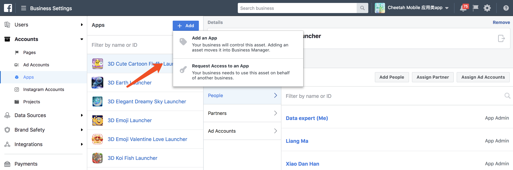

# 流川枫使用文档

## 广告创建工具

### 素材库

- 应用名称

选择主题应用名称，素材库是按主题名称来分类的

白牌需要选择对应的主题应用上传

- 关联账户

选择需要上传到的Facebook广告账号，选择账号错误会导致广告创建失败

- 文件属性

选择上传素材的属性（图片\视频\封面图），单次上传只能上传一类的素材。

- 文件选择

选择完文件后，可以单击每个文件右上角的按钮取消这一个文件的上传。

- 提交

单击提交素材后，提交素材的按钮颜色会变深，这是正在上传的标志，不要再次点击颜色变深的按钮。

**提交成功**后会跳转至素材查看界面

**提交失败**会显示失败提示，不会跳转界面

### 广告模板

### 创建广告

### Business Manager平台设置

#### 前期准备

- BM平台Admin权限账号

#### 1.将广告账户认领到BM平台下

#### 2.添加BM平台对应的system user为广告账户管理员

#### 3.认领APP到BM平台下

#### 4.Assign 广告账户到APP下

#### 5.添加BM平台对应的system user为APP管理员

#### 6.Assign APP和广告账户到对应的项目下

未做此步会导致工具无法拉取到APP、Account列表

