# 流川枫使用文档

## 目录
[TOC]

## 广告创建工具

- 创建广告步骤


```flow
st=>start: 开始创建
op=>operation: 创建广告模板
op2=>operation: 上传素材
op3=>operation: 创建广告
op4=>operation: 关联素材到广告组
op5=>operation: 查看创建结果
e=>end
st->op->op2->op3->op4->op5->e
```

### 素材库

[素材库地址](http://gp.launcher.cmcm.com/facebook-ads/index)

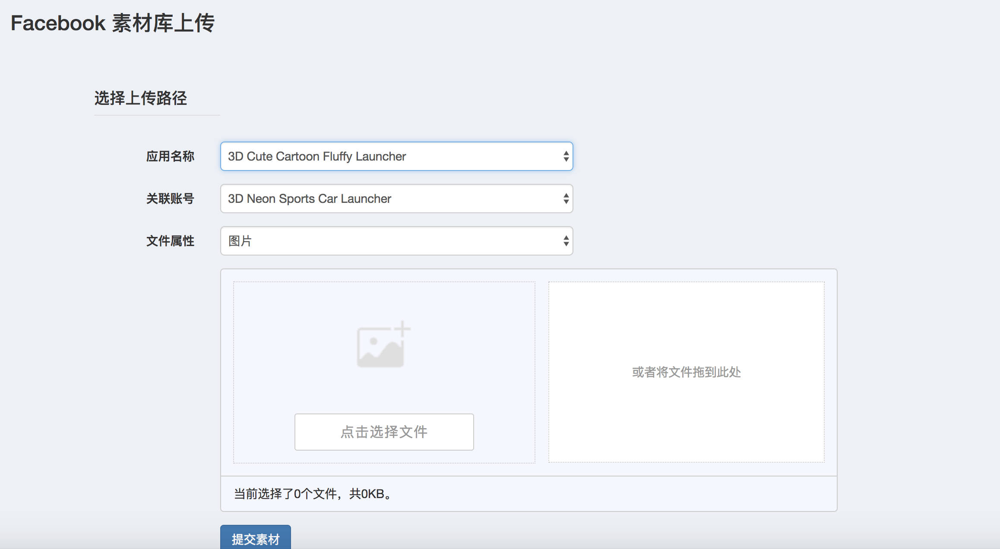

- 应用名称

选择主题应用名称，素材库是按主题名称来分类的

白牌需要选择对应的主题应用上传

- 关联账户

选择需要上传到的Facebook广告账号，选择账号错误会导致广告创建失败

- 文件属性

选择上传素材的属性（图片\视频\封面图），单次上传只能上传一类的素材。

在上传视频时，一次上传超过50MB的视频有一定的失败几率

- 文件选择

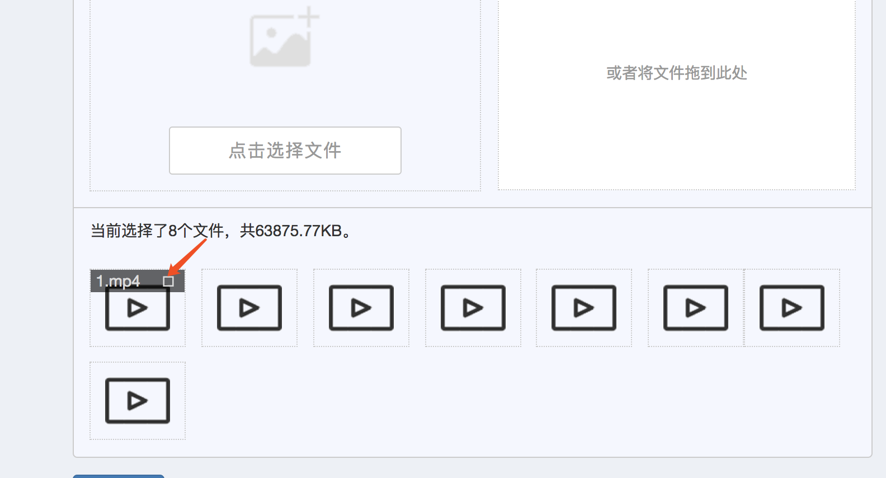

选择完文件后，可以单击每个文件右上角的按钮取消这一个文件的上传。

- 提交

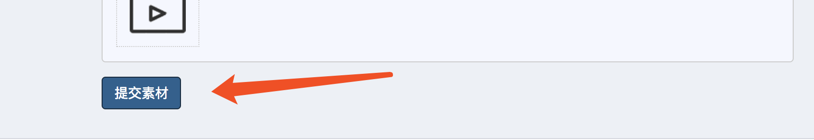

单击提交素材后，提交素材的按钮颜色会变深，这是正在上传的标志，不要再次点击颜色变深的按钮。

**提交成功**后会跳转至素材查看界面

**提交失败**会显示失败提示，不会跳转界面


### 广告模板

[广告模板地址](http://gp.launcher.cmcm.com/ad-tpl/create)

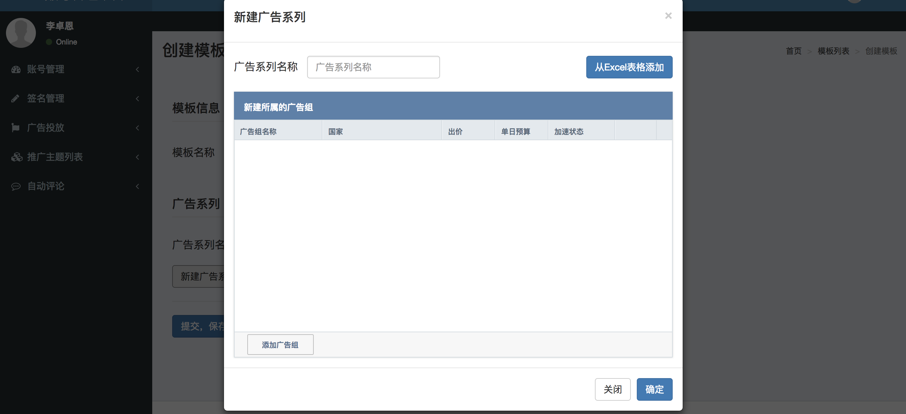

#### 模板名称

填写模板名称，需要注意的是所有人的模板都会在一起，所以需要加上自己的标记。

#### 新建广告系列

创建一个广告系列和其中的广告组

- 广告系列名称

这个广告系列名称不是正式名称，是正式名称的一部分

广告系列正式名称为：应用名+创建名称+广告系列名称（广告模板中填写）

- 广告组名称

这个广告组名称不是正式名称，是正式名称的一部分

广告组正式名称为：应用名+创建名称+广告系列名称（广告模板中填写）+广告组名称（广告模板中填写）

- 国家

需要填写中文

一个广告组需要关联多个国家的话，将多个国家用英文逗号","隔开即可

如要关联全球，在国家中填写''全球''即可，填写全球后，不可再用逗号关联多个国家

使用文档备注中有可用国家列表

- 出价

填写数字，限制范围0~2

- 单日预算

填写数字，需要大于0

- 加速状态

填写“加速”或“匀速”

- 单个添加

点击“添加广告组”之后，填写信息即可

- 批量添加

在Excel文档中编辑好信息后，点击“从Excel表格添加”后直接粘贴、确定即可

格式示例：[Excel模板下载]()

### 创建广告

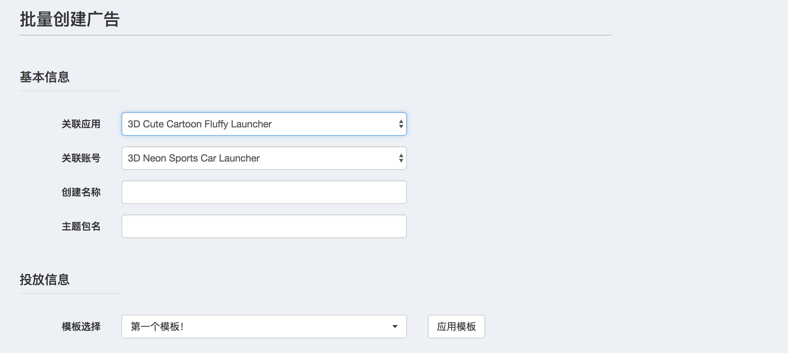

#### 关联应用

选择广告将要关联的应用

#### 关联账户

选择广告在哪个广告账户下创建

#### 创建名称 

这个创建名称不是正式名称，是正式名称的一部分

广告系列正式名称为：应用名+创建名称+广告系列名称（广告模板中填写）

#### 主题包名

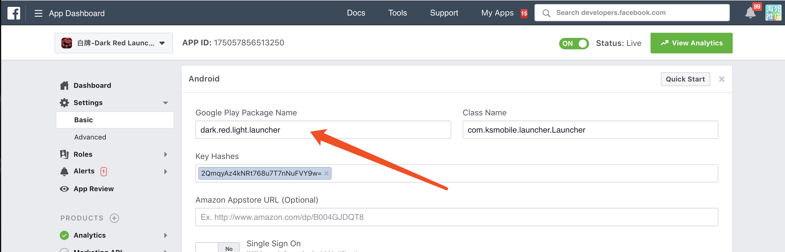

在Facebook后台应用设置中可以找到，设计师后台同样也能找到主题包名

#### 投放信息

选择要使用广告模板（需在创建广告前设置好）

#### 关联方式选择

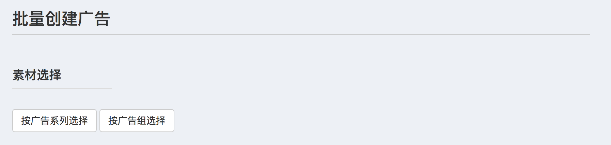

选择广告组，并给广告组关联素材，根据关联素材的数量，会在对应广告组下创建相应数量的广告

- 按广告系列选择

等同于选择该广告系列下所有广告组

- 按广告组选择

直接选择广告组，所有广告组将会展开供选择


#### 关联素材

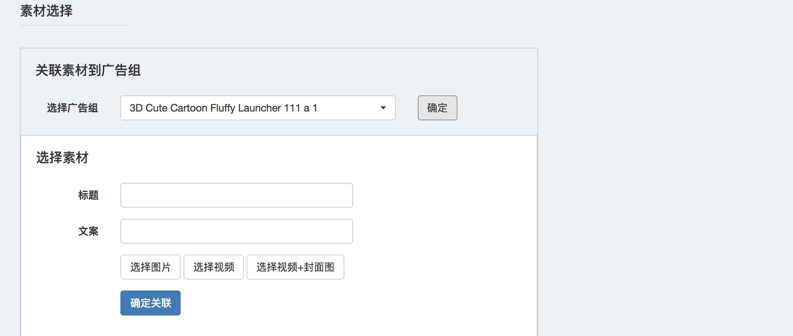

选择广告组后点击确定会出现选择素材界面

- 选择限制

一次关联只能选择图片、视频、视频+封面图中的一种

- 创建广告规则

选择N张图片，会在选定的广告组下分别创建N个广告

选择N个视频，会在选定的广告组下分别创建N个广告

选择N个视频+N个封面图，会在选定的广告组下分别以排列组合的方式创建N*N个广告

> 例：
>
> 选择视频：V1、V2
>
> 选择封面图：C1、C2
>
> 会创建2*2=4个广告，分别为
>
> V1-C1、V1-C2、V2-C1、V2-C2

- 多次关联

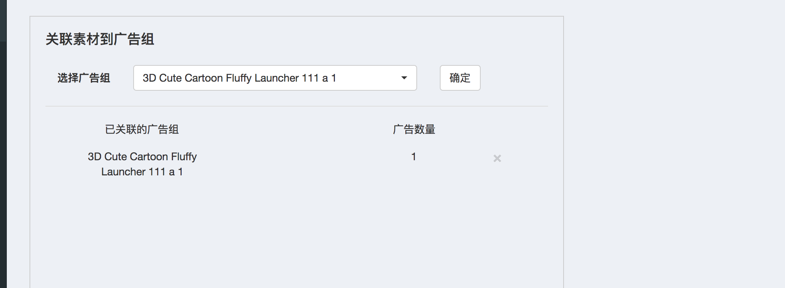

关联一次后，会将已关联的广告组和即将创建的广告数量显示出来，此时再次点击确定，再次进入关联素材界面

多次给一个广告组关联素材，会将多次关联的结果叠加创建在一个广告组中，不会再创建一个新的广告组


#### 广告列表

完成关联，点击创建广告后，程序会在后台执行创建操作，创建状态会显示在广告列表中

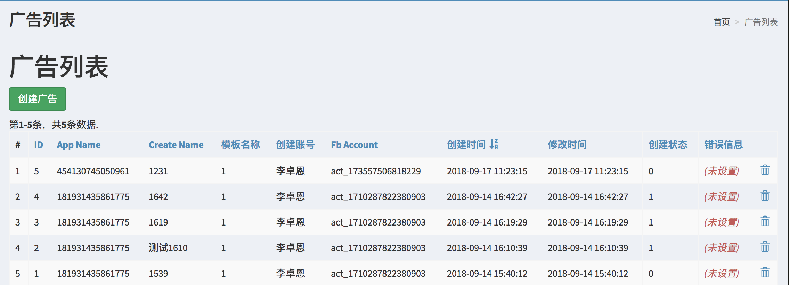

- 创建状态

0为正在创建，1为创建完成，2为创建失败

一次只能执行一个任务，如队列中有正在创建的任务，新提交的任务会在原有任务创建完之后创建

- 信息显示

列表中会显示创建广告任务的详细信息


### Business Manager平台设置

#### 前期准备

- BM平台Admin权限账号


#### 1.将广告账户认领到BM平台下

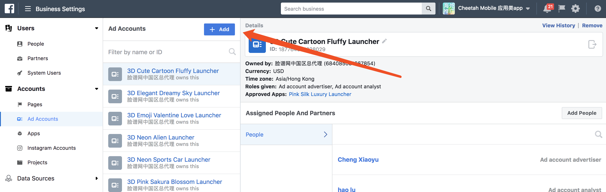

#### 2.添加BM平台对应的system user为广告账户管理员

- 2.1 需要添加为广告账户管理员的账户

需要添加为管理员的ID：

**Data expert (Me)**

**流川枫 (System User)**


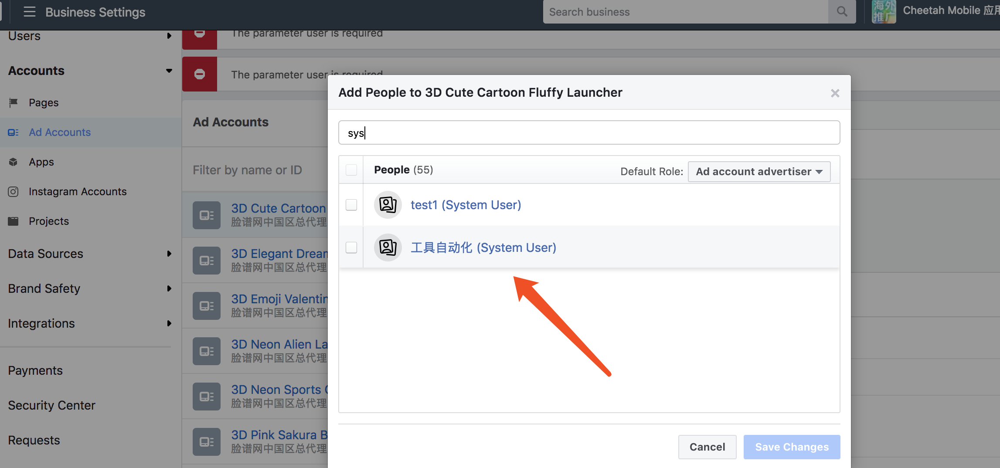

#### 3.认领APP到BM平台下

- 3.1 将管理账户添加为此App的管理员

需要添加为管理员的ID：**smith.amlie.7**

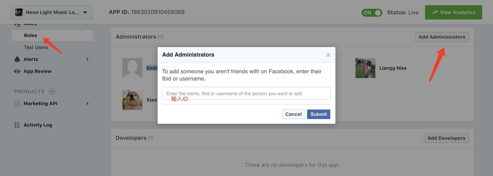

- 3.2 将‘Cheetah Mobile 应用类app’选为BM平台

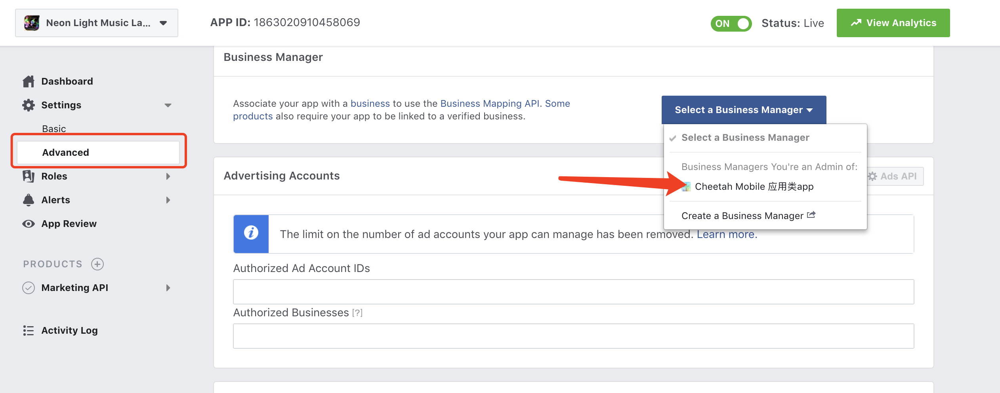


#### 4.Assign 广告账户到APP下

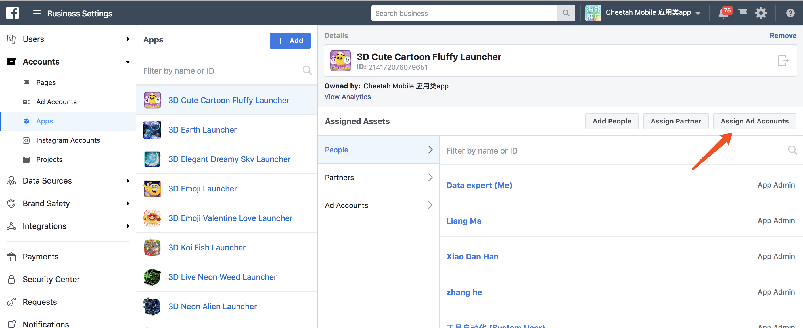

#### 5.添加BM平台对应的system user为APP管理员

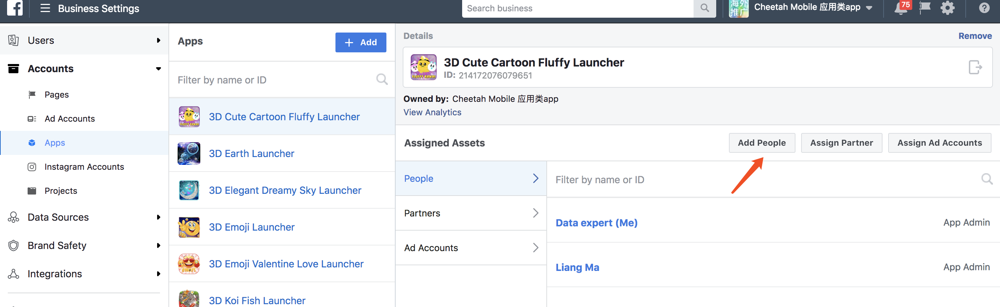

#### 6.Assign APP和广告账户到对应的项目下

未做此步会导致工具无法拉取到APP、Account列表


## 图片生成工具

- 图片生成步骤

```flow
st=>start: 开始生成
op=>operation: 设置图片模板
op2=>operation: 选择TID\模板\广告账户
op3=>operation: 选择生成图片
op4=>operation: 本地下载或上传FB素材库
e=>end
st->op->op2->op3->op4->e
```

### 图片生成

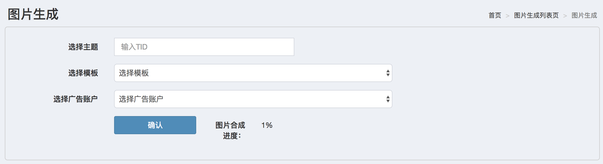

- 输入TID

仅限2D\3D已上架的官推主题

- 选择模板

选择图片生成模板（需要提前配置好）

- 选择广告账户

选择素材要上传的广告账户

### 图片预览

输入TID和模板后，会拉取主题的GP宣传图生成图片，生成后进入选择界面，可以取消效果不佳的图片。

选择完成后，可以下载到本地或者上传FB素材库（前一步选择的广告账户素材库）

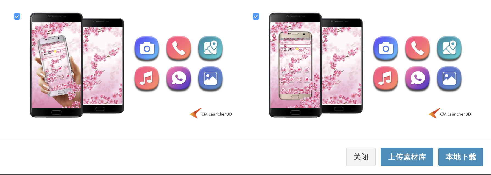


### 图片模板

- 上传底版图

仅支持单张1200*628的PNG

- 编辑模板

支持添加主题的以下GP宣传图以及icon

| 素材类型   | 像素_宽 | 像素_高 |
| ---------- | ------- | ------- |
| Cover      | 315     | 420     |
| icon       | 512     | 512     |
| Banner     | 1024    | 500     |
| Preview    | 720     | 1280    |
| Background | 720     | 1280    |

目前右边的编辑栏仅仅只是显示，并不支持设置的功能（图层设置除外）

- 图层设置

图层数字越大，排在越上面


## 备注

### 国家列表

| 国家                 | 代码 |
| -------------------- | ---- |
| 全球                 |      |
| 阿尔巴尼亚           | AL   |
| 阿尔及利亚           | DZ   |
| 阿根廷               | AR   |
| 阿拉伯联合酋长国     | AE   |
| 阿鲁巴               | AW   |
| 阿曼                 | OM   |
| 阿塞拜疆             | AZ   |
| 埃及                 | EG   |
| 爱尔兰               | IE   |
| 爱沙尼亚             | EE   |
| 安哥拉               | AO   |
| 奥地利               | AT   |
| 澳大利亚             | AU   |
| 巴布亚新几内亚       | PG   |
| 巴哈马               | BS   |
| 巴基斯坦             | PK   |
| 巴拉圭               | PY   |
| 巴拿马               | PA   |
| 巴西                 | BR   |
| 白俄罗斯             | BY   |
| 保加利亚             | BG   |
| 比利时               | BE   |
| 冰岛                 | IS   |
| 波多黎各             | PR   |
| 波兰                 | PL   |
| 波斯尼亚和黑塞哥维那 | BA   |
| 玻利维亚             | BO   |
| 伯利兹               | BZ   |
| 博茨瓦纳             | BW   |
| 布基纳法索           | BF   |
| 丹麦                 | DK   |
| 德国                 | DE   |
| 多哥                 | TG   |
| 俄罗斯               | RU   |
| 厄瓜多尔             | EC   |
| 法国                 | FR   |
| 菲律宾               | PH   |
| 芬兰                 | FI   |
| 佛得角               | CV   |
| 哥伦比亚             | CO   |
| 哥斯达黎加           | CR   |
| 海地                 | HT   |
| 韩国                 | KR   |
| 荷兰                 | NL   |
| 洪都拉斯             | HN   |
| 几内亚比绍           | GW   |
| 加拿大               | CA   |
| 加纳                 | GH   |
| 加蓬                 | GA   |
| 柬埔寨               | KH   |
| 捷克                 | CZ   |
| 津巴布韦             | ZW   |
| 喀麦隆               | CM   |
| 卡塔尔               | QA   |
| 科威特               | KW   |
| 克罗地亚             | HR   |
| 肯尼亚               | KE   |
| 拉脱维亚             | LV   |
| 老挝                 | LA   |
| 黎巴嫩               | LB   |
| 立陶宛               | LT   |
| 卢森堡               | LU   |
| 罗马尼亚             | RO   |
| 马耳他               | MT   |
| 马来西亚             | MY   |
| 马里                 | ML   |
| 马其顿               | MK   |
| 毛里求斯             | MU   |
| 美国                 | US   |
| 孟加拉国             | BD   |
| 秘鲁                 | PE   |
| 缅甸                 | MM   |
| 摩尔多瓦             | MD   |
| 摩洛哥               | MA   |
| 莫桑比克             | MZ   |
| 墨西哥               | MX   |
| 纳米比亚             | NA   |
| 南非                 | ZA   |
| 尼泊尔               | NP   |
| 尼加拉瓜             | NI   |
| 尼日尔               | NE   |
| 尼日利亚             | NG   |
| 挪威                 | NO   |
| 葡萄牙               | PT   |
| 日本                 | JP   |
| 瑞典                 | SE   |
| 瑞士                 | CH   |
| 萨尔瓦多             | SV   |
| 塞内加尔             | SN   |
| 塞浦路斯             | CY   |
| 沙特阿拉伯           | SA   |
| 斯里兰卡             | LK   |
| 斯洛伐克             | SK   |
| 斯洛文尼亚           | SI   |
| 塔吉克斯坦           | TJ   |
| 台湾                 | TW   |
| 泰国                 | TH   |
| 坦桑尼亚             | TZ   |
| 特立尼达和多巴哥     | TT   |
| 突尼斯               | TN   |
| 土耳其               | TR   |
| 土库曼斯坦           | TM   |
| 危地马拉             | GT   |
| 委内瑞拉             | VE   |
| 乌干达               | UG   |
| 乌克兰               | UA   |
| 乌拉圭               | UY   |
| 乌兹别克斯坦         | UZ   |
| 西班牙               | ES   |
| 希腊                 | GR   |
| 香港                 | HK   |
| 新加坡               | SG   |
| 新西兰               | NZ   |
| 匈牙利               | HU   |
| 牙买加               | JM   |
| 亚美尼亚             | AM   |
| 也门                 | YE   |
| 伊拉克               | IQ   |
| 以色列               | IL   |
| 意大利               | IT   |
| 印度                 | IN   |
| 印尼                 | ID   |
| 英国                 | GB   |
| 约旦                 | JO   |
| 越南                 | VN   |
| 赞比亚               | ZM   |
| 智利                 | CL   |
| 中国                 | CN   |